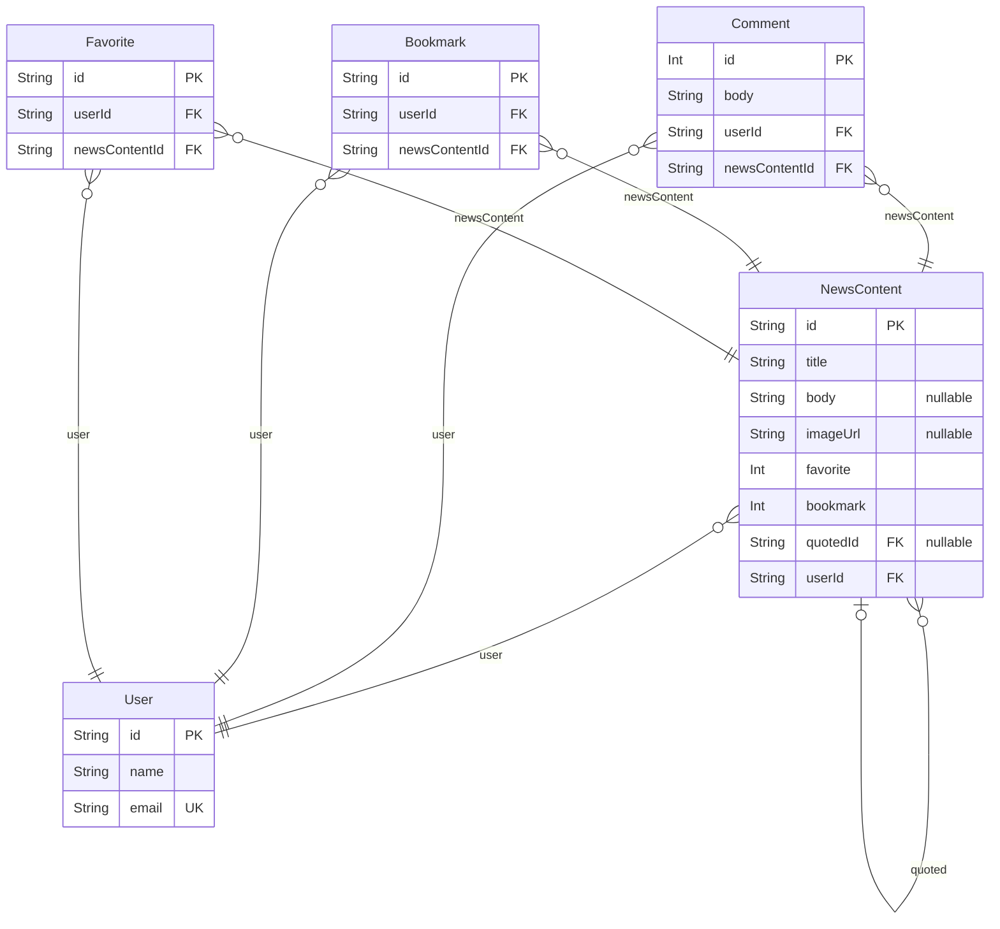

# Shopping Mall

> Generated by [`prisma-markdown`](https://github.com/samchon/prisma-markdown)

- [default](#default)

## default

### `User`

Properties as follows:

- `id`:
- `name`:
- `email`:

### `NewsContent`

Properties as follows:

- `id`:
- `title`:
- `body`:
- `imageUrl`:
- `favorite`:
- `bookmark`:
- `quotedId`:
- `userId`:

### `Comment`

Properties as follows:

- `id`:
- `body`:
- `userId`:
- `newsContentId`:

### `Bookmark`

Properties as follows:

- `id`:
- `userId`:
- `newsContentId`:

### `Favorite`

Properties as follows:

- `id`:
- `userId`:
- `newsContentId`:
